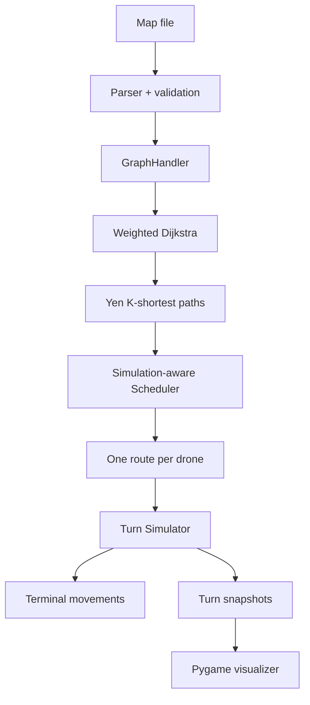
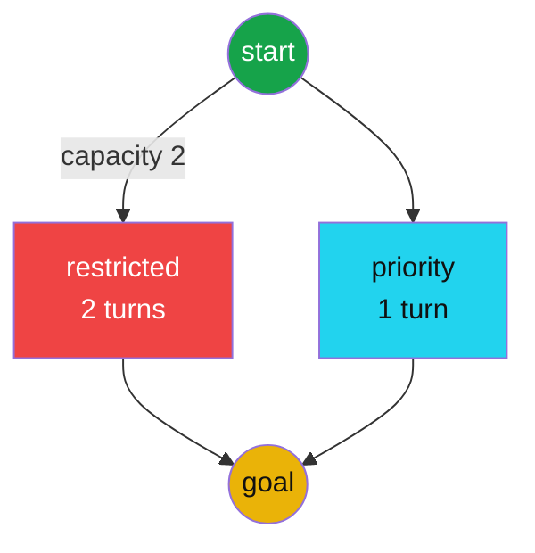
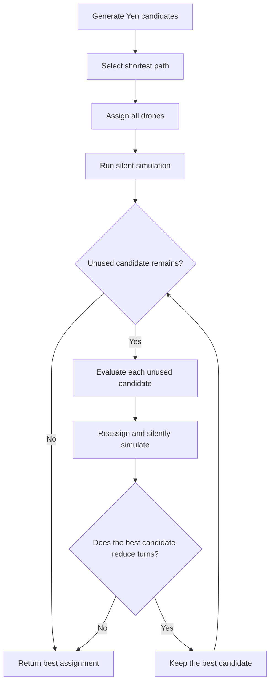
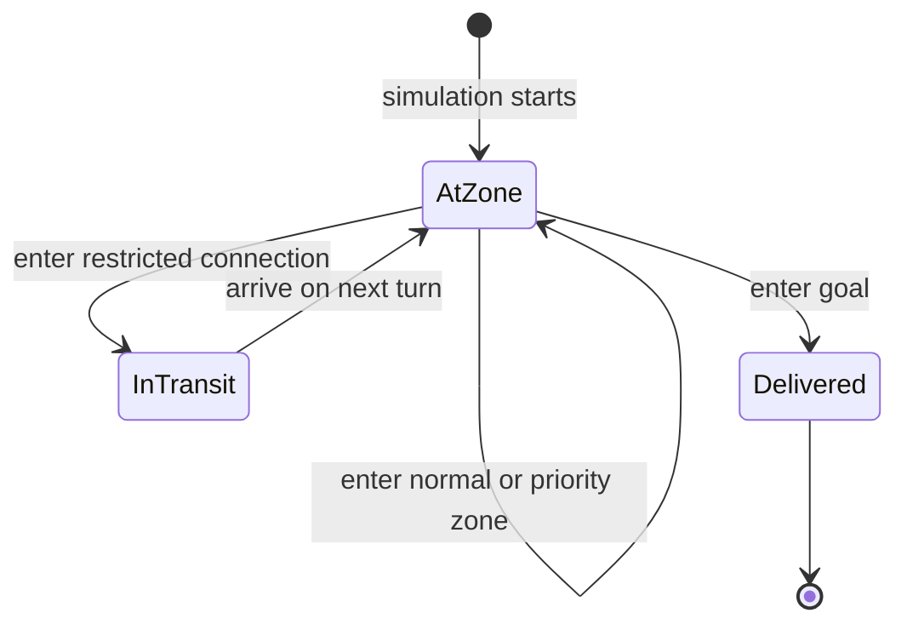

*This project has been created as part of the 42 curriculum by hfujisad.*

# Fly-in

## Table of contents

- [Description](#description)
- [Features](#features)
- [Instructions](#instructions)
- [Input format](#input-format)
- [Architecture](#architecture)
- [Algorithm choices and implementation strategy](#algorithm-choices-and-implementation-strategy)
- [Performance](#performance)
- [Project structure](#project-structure)
- [Resources](#resources)

## Description

Fly-in is a drone-routing simulator. It reads a text file describing a network
of zones and bidirectional connections, finds several candidate routes, assigns
drones to useful routes, and simulates all movements turn by turn. The main
objective is to deliver every drone from the unique start hub to the unique end
hub in as few turns as possible while respecting zone and connection capacity.

The implementation supports normal, priority, restricted, and blocked zones.
Entering a restricted zone takes two turns, priority zones are preferred when
otherwise equivalent routes are compared, and blocked zones are never used.

The project includes a Pygame visualizer that displays the graph and animates
the same turn snapshots produced by the terminal simulator.



## Features

- Strict input parsing and Pydantic-based model validation.
- Weighted shortest-path search without an external graph library.
- Yen's algorithm for generating alternative loopless paths.
- Simulation-based selection and distribution of routes.
- Turn-by-turn enforcement of zone and connection capacities.
- Two-turn transit handling for restricted zones.
- Priority-zone tie-breaking during pathfinding.
- Deadlock detection and strategic waiting when movement is unavailable.
- Terminal movement output in the required `D<ID>-<destination>` format.
- Smooth Pygame animation with forward, backward, reset, and speed controls.

## Instructions

### Quick start

```bash
make install
make run MAP=test.txt
make run MAP=test.txt ARGS=-v
```

### Requirements

- Python 3.10 or later
- GNU Make
- [uv](https://docs.astral.sh/uv/)

### Installation

Install the project and development dependencies with:

```bash
make install
```

This creates `.venv`, synchronizes the dependencies from `uv.lock`, and
installs `flake8` and `mypy` for the mandatory lint targets.

### Terminal execution

Run the default map:

```bash
make run
```

Run a specific map:

```bash
make run MAP=easy_01_linear_path.txt
```

The equivalent direct command is:

```bash
uv run fly_in.py easy_01_linear_path.txt
```

Each output line represents one simulation turn and contains only drones that
moved during that turn. A drone entering a restricted connection is displayed
with the connection endpoints, then reaches the restricted zone on the next
turn.

### Graphical visualization

Launch the Pygame visualizer with:

```bash
make run MAP=test.txt ARGS=-v
```

or:

```bash
uv run fly_in.py test.txt --vis
```

Visualizer controls:

| Input | Action |
|---|---|
| `Space` | Play or pause automatic playback |
| `Right Arrow` | Advance one turn |
| `Left Arrow` | Return one turn |
| `R` | Reset to turn zero |
| `Up Arrow` | Increase playback speed |
| `Down Arrow` | Decrease playback speed |
| `Esc` | Close the visualizer |

The visualizer calculates the complete simulation timeline once, stores
immutable snapshots, and interpolates drone positions between adjacent turns at
60 frames per second. Drones travelling toward restricted zones are shown on
the corresponding connection. This makes congestion, waiting, route sharing,
and two-turn movements easier to understand than terminal output alone.

### Debugging and code quality

```bash
make debug MAP=test.txt
make lint
make lint-strict
make test
make clean
```

`make lint` runs the mandatory `flake8` and `mypy` checks. `make lint-strict`
uses `mypy --strict` for stronger static checking, while `make test` invokes
Pytest through `uv run`. The `run`, `debug`, lint, and test targets all execute
their Python tools in the uv-managed project environment.

## Input format

A map begins with a positive drone count, followed by zones and connections:

```text
nb_drones: 3

start_hub: start 0 0 [color=green]
hub: restricted 1 0 [zone=restricted color=red max_drones=2]
hub: priority 1 1 [zone=priority color=cyan]
end_hub: goal 2 0 [color=yellow]

connection: start-restricted [max_link_capacity=2]
connection: start-priority
connection: restricted-goal
connection: priority-goal
```

Connections may only reference zones defined earlier in the file. Zone names
and coordinates must be unique. Start and end hubs ignore `max_drones` and have
unlimited occupancy.

The example above produces a graph with two alternatives:



## Architecture

| Component | Responsibility |
|---|---|
| `Parser` | Parse syntax, build validated models, and reject invalid maps |
| `GraphHandler` | Store adjacency data and provide weighted Dijkstra search |
| `YenPathFinder` | Generate alternative loopless routes |
| `Scheduler` | Assign drones and retain route sets that improve throughput |
| `Simulator` | Apply movement, occupancy, transit, and capacity rules |
| `PygameVisualizer` | Animate immutable turn snapshots at 60 FPS |

The core algorithm and the user interfaces are deliberately separated. Both
terminal output and Pygame consume the same Simulator behaviour, preventing the
visualizer from inventing movements that differ from the evaluated solution.

## Algorithm choices and implementation strategy

### Graph representation

`GraphHandler` stores zones by name, connections by a sorted endpoint tuple,
and an adjacency list from each zone to its incident connections. Sorting the
endpoint tuple gives both directions of a connection one shared capacity key.

### Weighted Dijkstra search

Dijkstra's algorithm calculates the minimum movement cost from a source. Normal
and priority destinations cost one turn, restricted destinations cost two, and
blocked destinations are skipped. The priority queue also carries a priority
score, so a route containing more priority zones wins when movement costs are
equal.

With `V` zones and `E` connections, one search using a binary heap takes
`O((V + E) log V)` time and `O(V + E)` memory.

### Yen's K-shortest paths

`YenPathFinder` starts with the Dijkstra route and creates alternatives by
temporarily banning root-path connections and nodes at each spur point. Candidate
paths are kept in a heap ordered by total cost, priority-zone count, and path.
Root costs are cached as cumulative sums to avoid repeatedly calculating the
same prefix cost.

For `K` requested paths, the worst-case running time is approximately
`O(K * V * (E + V) log V)`, depending on the number and length of generated spur
paths.

### Route scheduling

The scheduler first assigns all drones to the shortest candidate routes with a
heap-based cost score. It then adds unused Yen candidates one at a time and runs
a silent simulation for each alternative. A new route is retained only when it
reduces the measured completion turn. This allows multiple useful paths without
adding longer routes that do not improve throughput.

This optimization is intentionally simulation-aware: two routes with similar
lengths may behave very differently when they share a small-capacity zone or
connection.



### Turn simulation

The simulator tracks current zone occupancy, reserved restricted destinations,
per-turn connection use, and each drone's path index. Drones farther along their
routes are considered before following drones so that capacity freed during a
turn can be reused in that same turn. A restricted movement first places a drone
in transit and completes its arrival during the next call to `step()`.

`run_drone()` repeatedly calls `step()`, so terminal and graphical execution use
the same movement rules.



## Performance

The bundled maps currently complete in the following number of turns:

| Map | Turns | Subject target |
|---|---:|---:|
| Easy: linear path | 4 | 6 |
| Easy: simple fork | 4 | 8 |
| Easy: basic capacity | 4 | 6 |
| Medium: dead end trap | 8 | 12 |
| Medium: circular loop | 10 | 15 |
| Medium: priority puzzle | 6 | 12 |
| Hard: maze nightmare | 13 | 30 |
| Hard: capacity hell | 16 | 35 |
| Hard: ultimate challenge | 26 | 45 |
| Challenger: impossible dream | 43 | 45 reference |

All bundled maps meet or beat their subject targets. The optional Challenger
map also completes below the 45-turn reference.

## Project structure

```text
.
├── fly_in.py              # CLI entry point
├── parser.py              # CLI and map validation
├── patterns.py            # pyparsing grammar
├── models.py              # Validated models and immutable snapshots
├── graph_handler.py       # Graph indexes and weighted Dijkstra
├── yen_path_finder.py     # K-shortest loopless paths
├── scheduler.py           # Route selection and drone assignment
├── simulator.py           # Capacity-aware turn engine
├── pygame_visualizer.py   # Smooth timeline animation
├── util.py                # Shared connection-key helper
├── colors.py              # ANSI terminal color helpers
├── easy_*.txt             # Easy benchmark maps
├── medium_*.txt           # Medium benchmark maps
├── hard_*.txt             # Hard benchmark maps
├── challenger_*.txt       # Challenger benchmark map
├── test_*.txt             # Parser and scheduler test maps
├── MAPS.md                # Benchmark map documentation
├── Makefile
└── pyproject.toml
```

## Resources

- [Python documentation](https://docs.python.org/3/)
- [Python `heapq` documentation](https://docs.python.org/3/library/heapq.html)
- [Pygame documentation](https://www.pygame.org/docs/)
- [Pydantic documentation](https://docs.pydantic.dev/)
- [pyparsing documentation](https://pyparsing-docs.readthedocs.io/)

### Use of AI

AI assistance was used as a development aid for reviewing requirements,
explaining graph algorithms, diagnosing parser and simulation bugs, proposing
edge-case tests, checking type annotations, and drafting documentation. It was
also used to discuss the Pygame animation structure and route-selection
trade-offs. The project owner implemented, tested, reviewed, and adjusted the
final parser, graph algorithms, scheduler, simulator, and visualizer, and is
responsible for understanding and explaining the submitted code.
